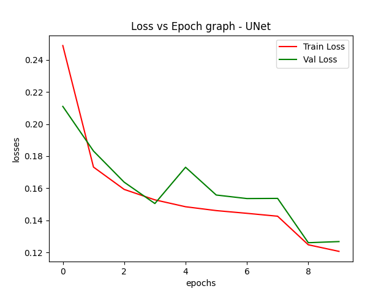
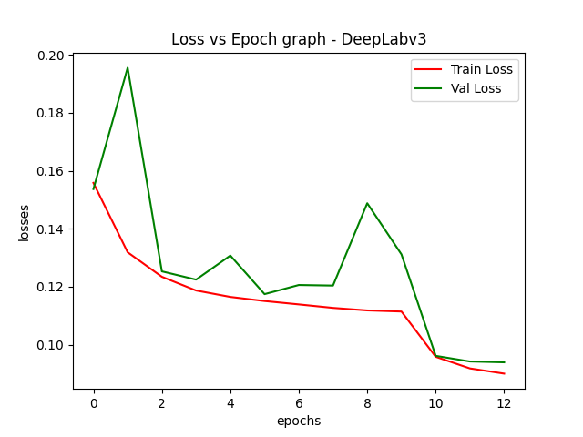
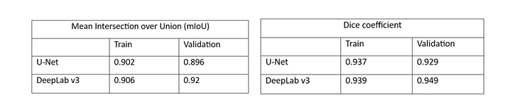

# Semantic Segmentation using UNet and DeepLab V3

This project intends to train, test & compare the performance of UNet and DeepLab V3 models for Semantic Segmentation

Download the dataset of your interest and place it in the dataset folder,
with train, test and val splits under the dataset folder.

## Data Preprocessing

```
python preprocess.py
```

## Model training

```
python train.py
```
Note: models.py contains the definitions of models used. 

## Best Model Inference
UNet:-
```
python inference_unet.py
```

DeepLab V3:-
```
python inference_deeplab.py
```

## Train loss graphs 
UNet loss graph:


DeepLab V3 loss graph:


## Metric value comparison:
Metrics used: Dice Co-efficient & mean Intersection over Union


## Observation/Conclusion

Both U-Net and DeepLab V3 effectively learned from the training data, with U-Net showing a more stable loss curve, while DeepLab V3 had minor fluctuations. Despite this, DeepLab V3 achieved higher mIoU and Dice scores for both training and validation, indicating better segmentation accuracy and generalization. Its superior performance is likely due to architectural features like dilated convolutions and atrous spatial pyramid pooling, which enhance global context understanding compared to U-Net's focus on local context.